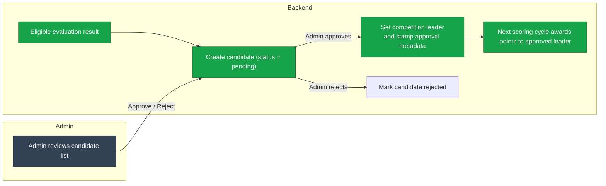

# Incentive Mechanism

Kinitro distributes incentives by translating evaluation outcomes into miner scores and network weights. The backend service owns the full loop: it aggregates results, applies competition rules, and broadcasts weight updates to validators so they can call `set_node_weights` on Bittensor.

## Scoring Pipeline

1. **Aggregate results** – Evaluation metrics land in the backend database.
2. **Eligibility checks** – Each competition declares minimum average reward, minimum success rate, and win margins. The backend filters results against those thresholds before considering them for scoring.
3. **Candidate queue** – Eligible challengers are stored as `CompetitionLeaderCandidate` rows with `pending` status instead of automatically overwriting the current leader.
4. **Admin approval** – Administrators review the pool of pending candidates, approving or rejecting them through the `/admin/leader-candidates` endpoints or the internal dashboard.
5. **Leader updates & normalization** – Approved candidates become the active leader, and only approved leaders participate in score normalization so weight broadcasts still sum to one.
6. **Schedule** – Periodic scoring is performed on a configurable cadence and caches the latest scores for broadcasting.

## Leader Approval Flow

Administrators can annotate approvals or rejections, and the backend records the reviewer, reason, and timestamp. Pending candidates remain in the queue until a decision is made, making it easy to compare multiple challengers side-by-side.

## Weight Broadcasting

1. **WebSocket broadcast** – The backend pushes weight messages to every connected validator.
2. **Chain update** – Validators commit weights on the Bittensor chain.
3. **Cache warmup** – The backend keeps a copy of the latest weights in memory so reconnecting validators receive immediate updates even before the next scoring cycle. Competitions without an approved leader simply contribute zero weight until an approval occurs.

## Configuration

- `score_evaluation_interval` and `weight_broadcast_interval` can be tuned per deployment through the backend configuration.
- Default thresholds for minimum average reward, minimum success rate, and win margin ship with safe baselines, but each competition can override them.
- Competitions award `points`, which can be used to weight scores across multiple benchmarks during aggregation.
- The admin review API (`/admin/leader-candidates`, `/approve`, `/reject`) requires an API key with the `admin` role.

## Operational Considerations

- Scores depend on trusted evaluation results. Validators should ensure evaluators are running the same container images and configuration to avoid inconsistent outcomes.
- When no miner satisfies a competition’s success criteria, the backend skips weight updates for that competition and previously broadcast weights decay to zero.
- Validators without an active API key will fail to receive weight updates.
