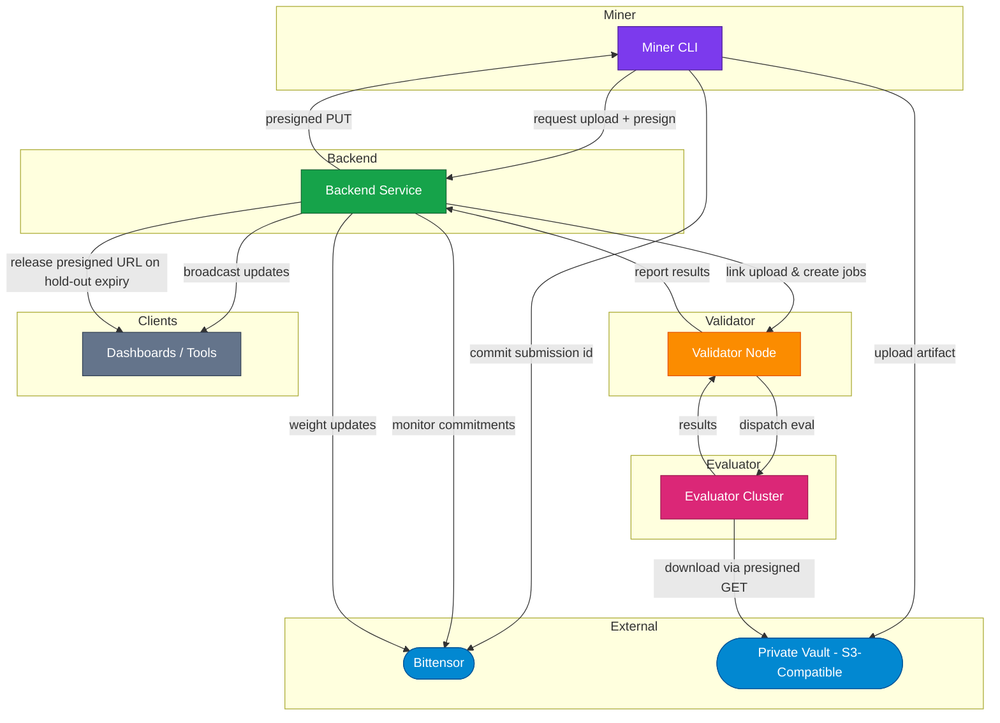
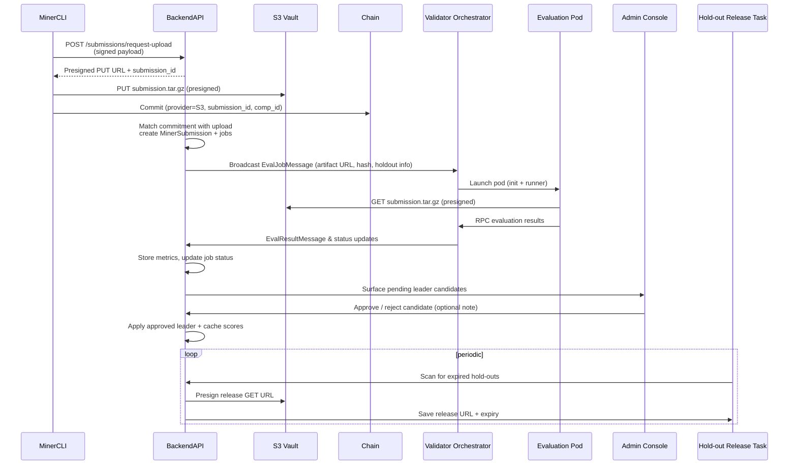

# Introduction

Kinitro incentivizes the emergence of agents that can conquer various tasks across different environments. Miners publish agents to compete, validators peform rollouts and evaluate the agents, and reward miners based on the results. All this happens in real-time and can easily be viewed by anyone through our [dashboard](https://kinitro.ai/dashboard).

## Platform Flow

1. **Submission** – The miner CLI packages the agent, requests a presigned upload slot from the backend, pushes the archive directly to the private vault, and commits the submission ID on Bittensor.
2. **Ingestion** – The backend ties the chain commitment to the uploaded artifact, records the submission with its hold-out window, and schedules evaluation jobs.
3. **Distribution** – Validators connect via WebSocket, receive jobs (including signed artifact URLs) and queue them for execution.
4. **Evaluation** – The orchestrator launches a Kubernetes pod per submission, Ray rollout workers evaluate the agent via RPC, and telemetry is logged.
5. **Results & Incentives** – Validators stream results back to the backend, which stores metrics, queues leader candidates for admin approval, emits realtime updates, and recalculates scores/weights once an approved leader exists. After hold-out expiry, the backend issues time-limited release URLs for public access.

## System Architecture

## Sequence Diagram

## Component Responsibilities

### Backend Service

- **FastAPI REST / Admin**: Hosts competition CRUD, submission uploads, stats, validator management, and WebSocket endpoints.
- **Chain Monitor & Scheduler**: Tracks Bittensor commitments, ties them to uploaded artifacts, creates `BackendEvaluationJob` records, and watches for stale work.
- **Hold-out & Vault Manager**: Issues presigned URLs for uploads and releases, enforces per-competition hold-out windows, and keeps artifacts private until expiry.
- **Realtime Broadcaster**: Manages client subscriptions and pushes structured events such as job updates, episode completions, and live stats.
- **Scoring & Weight Engine**: Periodically recalculates miner scores and pushes weight updates back to validators for on-chain emission.
- **Backend PostgreSQL**: Source of truth for competitions, submissions, jobs, job status, results, stats, and validator connections.

### Validator Node

- **WebSocket Client**: Authenticates with the backend, receives `EvalJobMessage` payloads, and streams results back.
- **pgqueuer Runner**: Persists jobs/results/episode logs in PostgreSQL so work survives restarts and can be retried.
- **Validator PostgreSQL**: Stores pgq queues plus normalized tables for jobs, results, and metrics consumed by the evaluator.

### Evaluator Cluster

- **Evaluator Orchestrator**: Listens to the pgqueuer queue, enforces concurrency caps, and coordinates job lifecycles.
- **Submission Pods**: Kubernetes pods created per submission to run miner containers in isolation.
- **Ray Rollout Workers**: Execute benchmark episodes, communicate with submission pods via RPC, and track success metrics.
- **Episode Logger**: Captures per-episode and per-step data, uploads media to S3-compatible storage, and enqueues telemetry for validator forwarding.

### Miner Tooling

- **Miner CLI**: Packages submissions, requests vault upload slots, pushes artifacts directly to the backend-controlled storage, and notarizes submissions on-chain.

### Real-time Clients

- Subscribe to the backend’s public WebSocket endpoint to monitor competitions, validator connectivity, and evaluation progress live.

## Next Steps

- Dive into the [Validator architecture notes](orchestrator.md) to see how the queue, database, and message formats interact.
- Review the [Evaluator internals](evaluator.md) for details on Ray workers, RPC bridges, and logging pipelines.
- Check the [Incentive mechanism](incentive.md) to understand how scores flow into weight updates.
