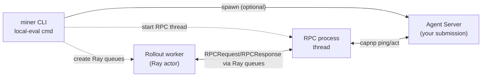

# Miner

## Setting up environment variables

Copy the `.env.miner.example` file to `.env` and fill in the required environment variables:

```bash
cp .env.miner.example .env
```

## Configuration

Copy the example configuration file, and edit it to include parameters like your backend URL, Bittensor wallet details, etc.

```bash
cp config/miner.toml.example miner.toml
```

Edit `miner.toml` to set your desired parameters.

## Uploading your agent

You can package your submission, submit an upload request, and upload the artifact directly to the validator-controlled vault.

To upload your agent, run:

```bash
python -m miner upload --config miner.toml
```

This command will:

- bundle the directory defined in `submission_dir` into `submission.tar.gz`
- calculate the SHA-256 hash and byte size of the archive
- sign an upload request with your hotkey keypair
- call the backend (`backend_url`) for a presigned upload URL
- upload the artifact to the vault

Ensure your `miner.toml` contains:

- `backend_url`: e.g. `https://api.kinitro.ai`
- `submission_dir`: path to your agent package
- wallet/hotkey configuration (used for signing)

## Committing submission info to the blockchain

After a successful upload, commit the returned submission to the Bittensor blockchain:

```bash
python -m miner commit --config miner.toml --submission-id <SUBMISSION_ID>
```

Only the submission id is required on-chain; the validator uses its own stored metadata (hash and size) during evaluation.

### Declaring dependencies

The evaluator installs your agent's Python dependencies into an isolated virtual environment inside the submission container before execution. Declare your dependencies using one of the following in the root of your submission archive:

- `requirements.txt` – standard pip requirements file
- `pyproject.toml` – your project is installed via `pip install /workspace/submission`

Notes:

- Network egress is allowed only during the init phase to install dependencies; runtime egress is blocked.
- The container includes minimal runtime packages for the RPC layer (`pycapnp`, `numpy`). You must include any ML/framework libraries (e.g., `torch`, `gymnasium`, `transformers`) your agent requires.
- A virtual environment is created at `/workspace/submission/.venv` and used to run your `main.py`.

## Local evaluation sandbox

Dry run your agent before uploading by spinning up the lightweight evaluator stack locally:

1. Update `miner.toml` with a `[local_eval]` block (defaults provided in `config/miner.toml.example`).
2. Start your agent server manually or set `agent_start_cmd` so the CLI launches it for you.
3. Run with a benchmark spec file:

```bash
uv run python -m miner local-eval --config miner.toml \
  --benchmark-spec-file config/benchmarks/local_mt10.json
```

The CLI connects to your agent, launches a single rollout worker on Ray, and streams benchmark metrics. When the run finishes it writes a JSON summary under `.kinitro/miner_runs/`.

> [!NOTE]
> On mainnet the evaluator launches your submission with the exact command:
> `/workspace/submission/.venv/bin/python /workspace/submission/main.py --host 0.0.0.0 --port 8000`.

`config/benchmarks/local_mt10.json` is an example spec file which runs MT10 tasks locally. You can read the current list of competitions and their respective benchmark specs [here](https://api.kinitro.ai/docs#/default/list_competitions_competitions_get) if you would like to evaluate your agent on these tasks before submitting it to our backend.



### Tips and troubleshooting

- `agent_start_cmd` can be any shell snippet (`uv run python submission_template/main.py --port 8000`).
- In your spec file, tune `episodes_per_task`, `max_episode_steps`, and `tasks_per_env` to keep runs lightweight.
- Logs and summaries live in `.kinitro/miner_runs/`; delete the directory to reset.
- If you see timeouts, confirm the agent RPC server is reachable on `agent_host:agent_port`.
